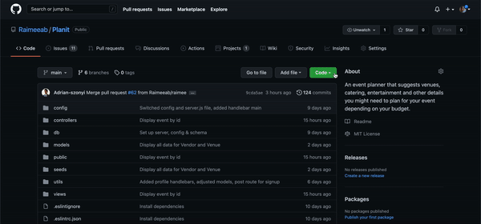
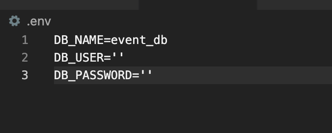
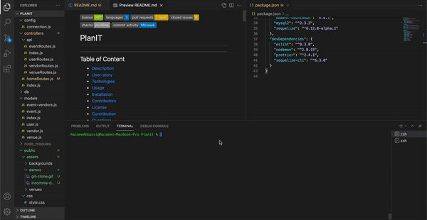
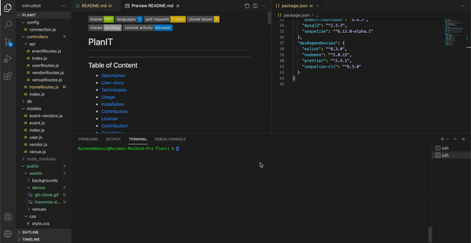
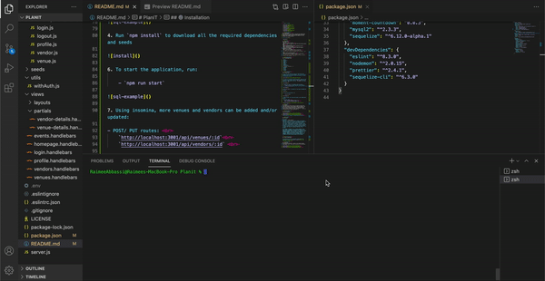
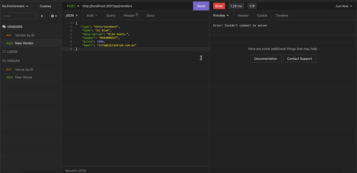

          

# PlanIT
---

## Table of Content 

* [Description](#description)
* [User-story](#user)
* [Technlogies](#technologies)
* [Usage](#usage)
* [Installation](#installation)
* [Contributors](#contributors)
* [License](#license)
* [Contribution](#contribution)
* [Questions](#questions)

## 📝 Description
Dear unorganised event planner, we've got you covered! This application will help you find suitable venues and vendors based on your number of guests and the budget you've set, whatever the occassion may be. 

Link to the [site]()

## 🕹 User-story
`As a user,`  
`WHEN I am create an account,`  
`THEN I am able to create a new event and view previous events made.` 
`WHEN I create an account,`  
`THEN I am prompted with questions regarding my event.`  
`WHEN I complete the prompts,`  
`THEN I am presented with potential venues and vendors depending on my budget. ` 
`WHEN I set an event date, ` 
`THEN I can see a countdown timer for that event.`  
<!-- `WHEN I click back to my current event,`  
`THEN I am able to adjust and update any of my details.`   -->
`WHEN I click on previous events,`  
`THEN I can see all my booked in details for that event.`  
<!-- `WHEN I click on vendors or venues,`   
`THEN I am able to see all the vendors and venues available for hire in the database.`   -->

## 🕹 Technologies used 

- Node.js
- Express.js
- Heroku
- Sequelize 
- MySQL
- Insomnia 
- Dotenv 
- Handlebars 
- Bootstrap CSS 
<!-- moment/ countdown.js -->
- Nodemailer 
- bycrypt 
- eslint
- prettier 
- nodemon

## ⚙️ Installation 

1. Git clone this repository onto your local machine and navigate to the file on your terminal. *This can also be done by opening the file on Visual Studios and running it through the intergated terminal.*

2. In order for the app to function correctly, ensure you have the latest or most stable version of Node.js and that you've entered your MySQL details (user & password) into the `.env.EXAMPLE` and rename the file to `.env`.

3. Create the schema from the MySQL shell by running: 
    - `mysql -u root -p` (enter password if/when prompted)
    - `source db/schema.sql`
 

4. Run `npm install` to download all the required dependencies and seeds

6. To start the application, run:

    - `npm run start`

7. Using insomina, more venues and vendors can be added and/or updated:

- POST/ PUT routes:  
    `http://localhost:3001/api/venues/:id` 
    `http://localhost:3001/api/vendors/:id`  

## 🖥 Usage 
This application allows the user to create an account and input event details to get suitable venues and vendors. The user can then contact them directly to check availability. Once the desired vendors and venue are selected, the user would an event card with all their details. <!-- , along with a countdown timer to their event date. -->

## 👥 Contributors

*[Raimee Abbassi](https://github.com/Raimeeab)*  
*[Nick Smith](https://github.com/N1cholasSmith)* 
*[Adrian Szonyi](https://github.com/Adrian-szonyi)*  
*The Univserity of Sydney | Trilogy Education Services*  

## 🔖 License

MIT License
Copyright (c) [2021] [PlanIT]
Permission is herby granted, free of charge, to any person obtaining a copy of this software and associated documentation files (the "Software"), to deal in the Software without restriction, including without limiation the rights to use, copy, modify, merge, publish, distribute, sublicense, and/or sell copies of the Software, and to permit persons to whom the Software is furnished to do so, subject following coditions: 
The above copyright notice and this permission notice shall be included in all copies or substantial portions of the Software. 

THE SOFTWARE IS PROVIDED "AS IS", WITHOUT WARRANTY OF ANY KIND, EXPRESS OR IMPLIED, INCLUDING BUT NOT LIMITED TO THE WARRANTIES OF MECHANTABILITY, FITNESS FOR A PARTICULAR PURPOSE AND NONINFRINGEMENT. IN NO EVENT SHALL THE AUTHORS OR COPYRIGHT HOLDERS BE LIABLE FOR ANY CLAIM, DAMAGES OR OTHER LIABILITY, WHETHER IN AN ACTION OF CONTRACT, TORT OR OTHERWISE, ARISING FROM, OUT OF OR IN CONNECTION WITH THE SOFTWARE OR THE USE OF OTHER DEALINGS IN THE SOFTWARE.  

---

## 🤝 How to Contribute

For information on how to contribute, please follow the guidlelines listed in [Contributor Covenant](https://www.contributor-covenant.org/).

## ❓ Questions
If you have any questions, contact us via [email](raimee.abbassi@gmail.com). You can also find more of our work here: 

[Raimee Abbassi](https://github.com/Raimeeab)  
[Nick Smith](https://github.com/N1cholasSmith) 
[Adrian Szonyi](https://github.com/Adrian-szonyi)  
